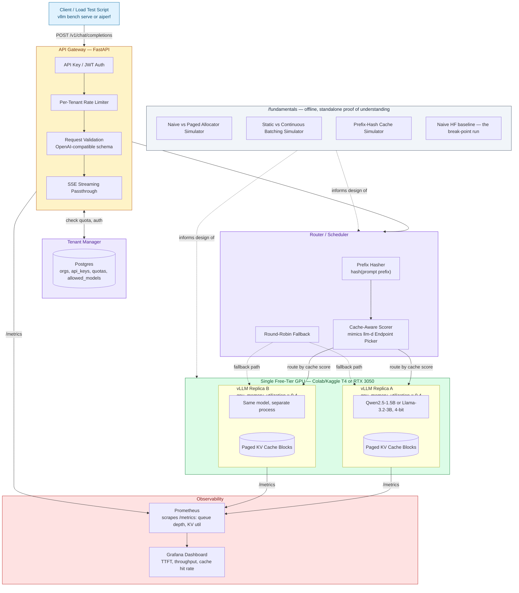

# Atlas — MVP Architecture

Single free-tier GPU (Colab/Kaggle T4 or RTX 3050), multi-tenant FastAPI gateway, prefix-aware routing, offline `fundamentals/` proof-of-understanding module.

**Constraint:** production-grade multi-tenant LLM serving behavior on constrained hardware — not multi-node / RDMA.

Paste the diagram into [mermaid.live](https://mermaid.live), a GitHub `.md` fence, or Confluence Mermaid.

## Diagram

## Repo mapping

| Diagram box | Path |
| --- | --- |
| API Gateway | `platform/gateway/` |
| Tenant Manager | `platform/tenant/` |
| Router / Scheduler | `platform/router/` |
| vLLM replicas | `workers/vllm/` |
| Observability | `platform/observability/` + `dashboard/` |
| Fundamentals | `fundamentals/` |

## Related

- [Target / production architecture](TARGET_ARCHITECTURE.md) — what this MVP steps toward  
- [MVP vs final capability table](MVP_VS_FINAL.md)
