# Atlas — Project Deep Dive

**Audience:** engineers joining the repo, interview prep, or anyone who needs the full map of *what exists*, *how requests flow*, and *what was measured*.  
**Status:** Phases 0–6 complete on the free path (laptop RTX 3050 4 GiB + Colab/Kaggle T4).  
**Constraint (non-negotiable):** production-grade multi-tenant LLM serving *behavior* without claiming multi-node / RDMA / DistServe.

Related short docs: [MVP architecture](MVP_ARCHITECTURE.md) · [Target architecture](TARGET_ARCHITECTURE.md) · [MVP vs final](MVP_VS_FINAL.md) · [HANDOFF](../HANDOFF.md) · [Pitch](../pitch/ONE_PARAGRAPH.md) · [Claim inventory](../phases/phase-6/CLAIM_INVENTORY.md)

---

## Table of contents

1. [What Atlas is (and is not)](#1-what-atlas-is-and-is-not)
2. [System architecture](#2-system-architecture)
3. [Repository layout](#3-repository-layout)
4. [Phase-by-phase what we built](#4-phase-by-phase-what-we-built)
5. [Runtime request path (gateway)](#5-runtime-request-path-gateway)
6. [Routing strategies in detail](#6-routing-strategies-in-detail)
7. [Tenancy, RPM, and worker registry](#7-tenancy-rpm-and-worker-registry)
8. [Workers and the OpenAI client](#8-workers-and-the-openai-client)
9. [Observability: Prometheus, OTEL, event ring, dashboard](#9-observability-prometheus-otel-event-ring-dashboard)
10. [Offline routing matrix (Phase 5)](#10-offline-routing-matrix-phase-5)
11. [Fundamentals: Phase 1–3 experiments](#11-fundamentals-phase-13-experiments)
12. [Configs, deploy sketches, and ops](#12-configs-deploy-sketches-and-ops)
13. [File-by-file reference](#13-file-by-file-reference)
14. [Data contracts and HTTP API](#14-data-contracts-and-http-api)
15. [Honesty rules and known ceilings](#15-honesty-rules-and-known-ceilings)
16. [How to run everything](#16-how-to-run-everything)
17. [What was deliberately not built](#17-what-was-deliberately-not-built)

---

## 1. What Atlas is (and is not)

### Is

A **research / systems demonstration** that:

- Measures real failure modes on constrained GPUs (naive HF concurrency cliff; vLLM reconciliation).
- Implements readable CPU toys for paging, continuous batching, and prefix caching.
- Ships a thin **OpenAI-compatible FastAPI gateway** with multi-tenant API keys, process-local RPM, and three routing strategies.
- Finds a **surprising routing loss case** (prefix-aware wins cache hits, loses simulated TTFT under high reuse).
- Exposes a **live dashboard** fed from the same request-path instrumentation as Prometheus.
- Closes with an honest pitch that only cites measured artifacts.

### Is not

- A Kubernetes multi-cluster product.
- DistServe / RDMA / multi-node prefill–decode disaggregation (documented as future work only).
- A claim that Phase 5 simulated TTFT is GPU truth.
- Production HA multi-replica rate limiting (RPM and event ring are **process-local**).

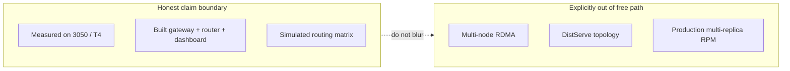

---

## 2. System architecture

### 2.1 Two layers: fundamentals vs platform

Atlas intentionally splits **proof-of-understanding** from **serving path**:

| Layer | Path | Role |
| --- | --- | --- |
| Fundamentals | `fundamentals/` | Offline math, sims, HF/vLLM load scripts. No tenants, no auth. |
| Platform | `platform/` + `workers/` + `dashboard/` | Live OpenAI API, routing, metrics, UI. |
| Evidence | `results/` | CSVs/charts that pitch and Phase 6 must cite. |

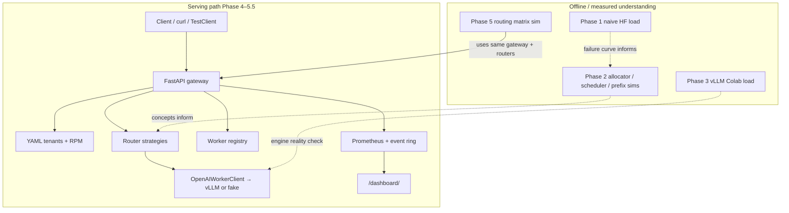

### 2.2 MVP runtime (what actually runs on free path)

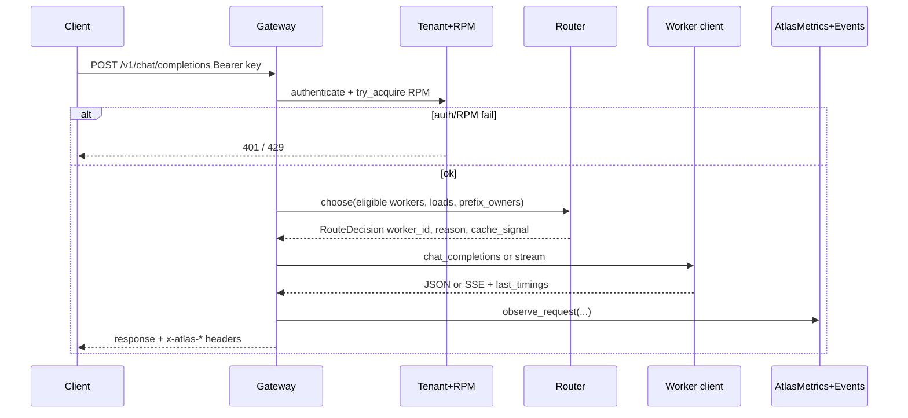

### 2.3 Target / north star (not claimed as implemented)

See [TARGET_ARCHITECTURE.md](TARGET_ARCHITECTURE.md): disaggregated prefill/decode, distributed KV indexer, K8s + KEDA, org-level tenancy. Phase 6 pitch points here as **informed future work**.

### 2.4 Import / packaging model

`pyproject.toml` uses `package = false`. Pytest and uvicorn rely on **`pythonpath`** to package dirs so imports are basename-style:

- `from app import create_app`
- `from strategies import PrefixAwareRouter`
- `from openai_worker_client import OpenAIWorkerClient`

There is no `from platform.gateway.app import ...` package layout. Scripts that run outside pytest (e.g. `benchmarks/run_routing_matrix.py`) manually `sys.path.insert` the same directories.

---

## 3. Repository layout

```text
Atlas/
├── fundamentals/     # Phase 1–2 toys + Phase 1/3 experiment scripts
├── platform/         # Gateway, tenant, router, registry, observability, autoscaling tests
├── workers/          # OpenAI worker HTTP client + vLLM pin helper (no tenant logic)
├── benchmarks/       # Phase 5 offline routing matrix
├── dashboard/        # Static Phase 5.5 UI served at /dashboard/
├── configs/          # YAML: models, tenants, workers, routing, prometheus
├── results/          # Measured CSVs/charts (source of truth for claims)
├── deploy/           # Helm/K8s empty; KEDA YAML sketch only
├── notebooks/        # Colab Phase 3 notebooks
├── scripts/          # One-shot helpers (e.g. WSL vLLM verify)
├── docs/             # Phases, ADRs, knowledge, research, pitch, handoff
├── docker-compose.obs.yml
├── pyproject.toml
└── README.md
```

**Boundary rule:** workers know nothing about tenants. Gateway owns auth, RPM, routing, and metrics.

---

## 4. Phase-by-phase what we built

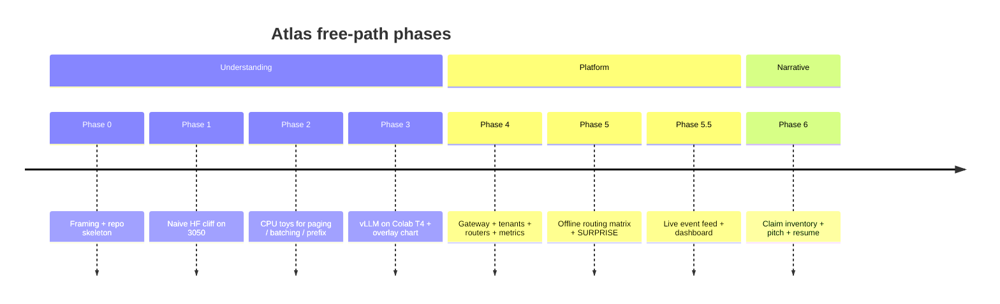

| Phase | Implementation | Eye-stopper artifact |
| --- | --- | --- |
| **0** | Framing sentence, ADRs, directory skeleton | `docs/framing/ONE_SENTENCE.md` |
| **1** | `naive_hf_load.py`, plot script, memory math docs | `results/phase1/naive_load.csv`, `oom_latency_curve.png` — N=8 ≈ **5.5×** p50 |
| **2** | `allocator_sim`, `scheduler_sim`, `prefix_cache_sim` | `results/phase2/*.csv` |
| **3** | `vllm_load.py` + Colab notebooks; pin `0.26.0` | `results/phase3/vllm_load.csv`, `naive_vs_vllm.png` |
| **4** | Full gateway stack under `platform/` + worker client | OpenAI path + Prometheus (offline-hardened) |
| **5** | Matrix harness + `SimulatedWorkerClient` | `results/phase5/routing_matrix.csv` + `SURPRISE.md` |
| **5.5** | `RequestEventLog`, `/atlas/*`, `dashboard/index.html` | Live UI; video deferred |
| **6** | Docs only: inventory, pitch, resume, README arc | `docs/phases/phase-6/`, `docs/pitch/` |

### Measured headlines (do not invent beyond these)

| Source | Finding |
| --- | --- |
| Phase 1 | Qwen2.5-0.5B HF on 3050: N=1 p50 **1671 ms**; N=8 p50 **9242 ms** (~5.5×); peak VRAM ~1043 MB |
| Phase 3 | vLLM 0.26.0+cu129 on T4: batch wall ~210–266 ms N=1..8; ~15 GB flat NVML; overlay **cross-hardware** |
| Phase 5 | high_reuse × prefix_aware: hit% **95.83**, TTFT p50 **297.5** vs RR **147.5** (sim only) |

---

## 5. Runtime request path (gateway)

**Entrypoint:** `platform/gateway/app.py`

- Factory: `create_app(tenants_path, workers_path, strategy, ...)`
- Uvicorn: `create_app_from_env()` reads `ATLAS_TENANTS`, `ATLAS_WORKERS`, `ATLAS_STRATEGY`

### 5.1 App construction

On create, the gateway:

1. Loads tenants YAML → `list[Tenant]`
2. Loads workers YAML → `list[Worker]`
3. Builds router via `build_router(strategy)`
4. Creates `ProcessLocalRPMLimiter`, `AtlasMetrics` (with event ring), client cache + locks
5. Stores mutable routing state on `app.state`:
   - `loads: dict[str, int]` — in-flight count per worker
   - `prefix_owners: dict[str, str]` — prefix hash → worker id (no eviction yet)
6. Mounts `/dashboard` StaticFiles if `dashboard/` exists

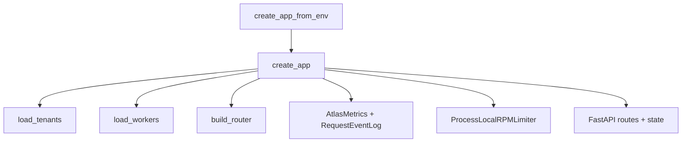

### 5.2 `POST /v1/chat/completions` step-by-step

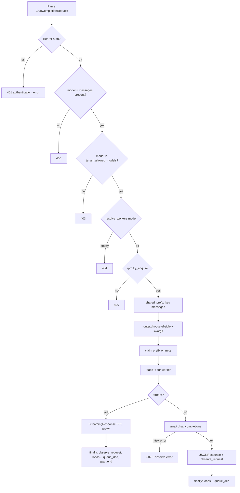

**Important behaviors:**

| Behavior | Detail |
| --- | --- |
| RPM charge | On **accept** (`try_acquire`), before upstream call — not on success |
| Stream cleanup | Stream generator owns `observe_request` / load dec / span end (`stream_owns_cleanup`) |
| Non-stream cleanup | Outer `finally` decrements load + queue; observes on success or maps httpx → 502 |
| Sync worker offload | Sync `chat_completions` / sync stream iterators run via `asyncio.to_thread` |
| Client cache | One `OpenAIWorkerClient` (or factory stub) per `base_url`, lock-guarded |
| Route headers | Always include worker, strategy, reason, tenant, rpm scope, cache signal |

### 5.3 Other gateway routes

| Method | Path | Auth | Purpose |
| --- | --- | --- | --- |
| GET | `/healthz` | none | Liveness |
| GET | `/metrics` | Bearer | Prometheus text exposition |
| GET | `/atlas/snapshot` | Bearer **or** `?api_key=` | Recent events JSON |
| GET | `/atlas/events` | Bearer **or** `?api_key=` | SSE catch-up + live (`catchup_only` for tests) |
| GET | `/dashboard/` | none for static HTML; API key entered in UI | Live UI |

Query `api_key` exists only because browser `EventSource` cannot set Authorization headers easily. Chat completions still require Bearer.

---

## 6. Routing strategies in detail

**File:** `platform/router/strategies.py`

### 6.1 Shared types

```text
RouteDecision
  worker_id: str
  strategy: str          # round_robin | least_load | prefix_aware
  reason: str            # human-readable decision string
  cache_signal: str      # hit | miss | n/a
```

### 6.2 Prefix key (not vLLM block APC)

`shared_prefix_key(messages)`:

1. Prefer first message with `role == "system"` → hash `system:{content}`
2. Else hash first message `role:content`
3. Hash = SHA-256 hex truncated to 16 chars (`prefix_hash`)

**Honesty:** this is a **router-local affinity key**, not engine automatic prefix cache / block-aligned APC.

### 6.3 Strategy algorithms

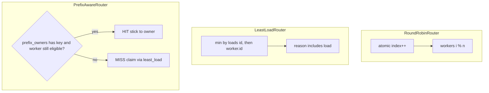

| Strategy | Inputs | Decision | cache_signal |
| --- | --- | --- | --- |
| `round_robin` | eligible workers | rotating index | `n/a` |
| `least_load` | workers + `loads` | min `(load, worker.id)` | `n/a` |
| `prefix_aware` | workers + `prefix_key` + `prefix_owners` + `loads` | sticky hit; miss → least_load claim | `hit` / `miss` |

**Gateway writeback on miss:** `_claim_prefix` sets `prefix_owners[key] = worker_id` only when `cache_signal == "miss"`. No LRU eviction (`# ponytail` comment in code).

### 6.4 Why prefix-aware can lose (Phase 5 surprise)

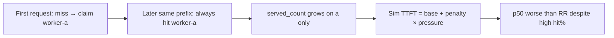

Production systems add a **TTFT / load gate** to break stickiness when the warm replica is too hot. Atlas documents that as follow-up; it is **not** implemented yet.

---

## 7. Tenancy, RPM, and worker registry

### 7.1 Tenants — `platform/tenant/tenants.py`

```yaml
# configs/tenants/example.yaml
tenants:
  - id: demo
    api_key: sk-atlas-demo-key
    rpm_limit: 60
    allowed_models:
      - Qwen/Qwen2.5-0.5B-Instruct
```

- `load_tenants(path)` → frozen `Tenant` dataclasses
- `authenticate(tenants, api_key)` → linear scan match (fine for demo YAML size)

No Postgres. MVP diagram shows Postgres as aspirational; free path is YAML.

### 7.2 RPM — `platform/tenant/rpm.py`

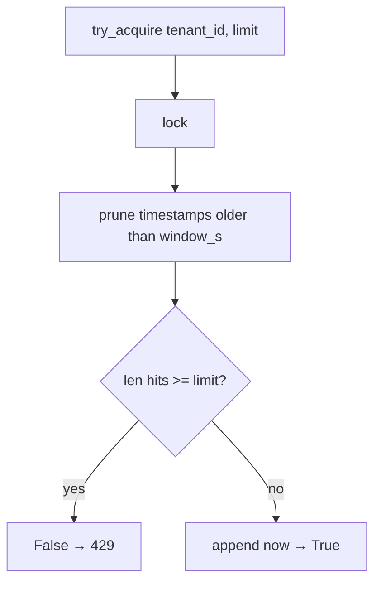

- Scope constant: `RPM_SCOPE = "process-local"` (also HTTP header `x-atlas-rpm-scope`)
- Sliding window default 60s
- Thread-safe via `threading.Lock`
- **Not** safe across multiple gateway replicas

### 7.3 Worker registry — `platform/registry/workers_registry.py`

```yaml
# configs/models/workers.yaml
workers:
  - id: worker-a
    model: Qwen/Qwen2.5-0.5B-Instruct
    base_url: http://127.0.0.1:8001/v1
  - id: worker-b
    model: Qwen/Qwen2.5-0.5B-Instruct
    base_url: http://127.0.0.1:8002/v1
```

- `resolve_workers(workers, model)` filters by exact model string
- Dual workers on free path usually mean **time-sliced / sequential** processes, not simultaneous multi-GPU

---

## 8. Workers and the OpenAI client

### 8.1 Boundary

`workers/` talks OpenAI HTTP only. It must not import tenants or RPM.

### 8.2 `OpenAIWorkerClient` — `workers/openai_worker_client.py`

| Method | Behavior | Timings |
| --- | --- | --- |
| `chat_completions` | POST `/chat/completions`, raise_for_status | `completion_ms`; `ttft_ms=None` (no first-token signal) |
| `stream_chat_completions` | streaming POST; yield SSE lines | sets `ttft_ms` on first `data:` chunk that is not `[DONE]` |
| `close` | closes owned httpx client | used by gateway lifespan |

Gateway stores timings via `client.last_timings` after each call.

### 8.3 `vllm_pin.py`

Asserts pinned version string `0.26.0` for Colab/WSL verification — keeps Phase 3 reproducible.

### 8.4 Simulated worker — `benchmarks/fake_worker.py`

Used only by Phase 5 matrix:

\[
\text{TTFT} = \text{base(hit 10ms / miss 100ms)} + 25\text{ms} \times (\text{served\_count} + \text{in-flight load})
\]

Warms a local `_warm` set of prefix keys. **Labeled fake — never hits a GPU.**

---

## 9. Observability: Prometheus, OTEL, event ring, dashboard

### 9.1 Metrics — `platform/observability/atlas_metrics.py`

| Metric | Type | Labels / notes |
| --- | --- | --- |
| `atlas_requests_total` | Counter | tenant, strategy, worker_id, outcome |
| `atlas_cache_signals_total` | Counter | cache_signal |
| `atlas_ttft_ms` | Histogram | worker_id |
| `atlas_completion_ms` | Histogram | worker_id |
| `atlas_tokens_per_s` | Histogram | worker_id |
| `atlas_queue_depth` | Gauge | process-local in-flight |

`observe_request(...)` updates Prometheus **and** publishes a `RequestEvent`.

### 9.2 Event ring — `platform/observability/request_events.py`

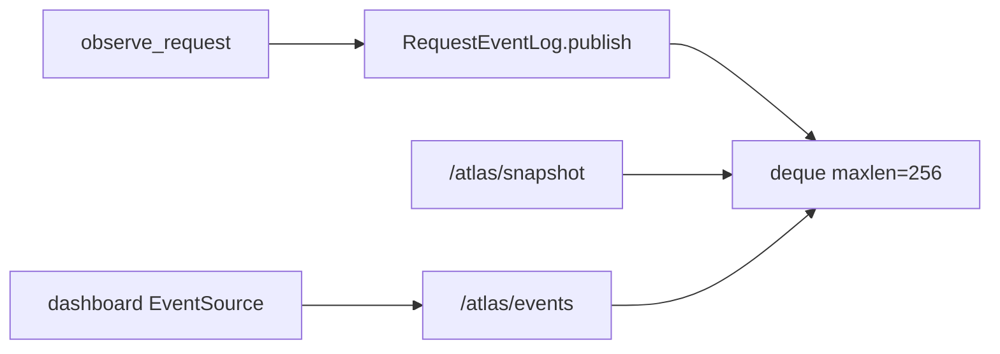

- Monotonic `id`, wall `ts`
- Fields: tenant, strategy, worker, reason, cache_signal, outcome, ttft/completion/tokens, queue_depth
- **Never** stores prompt / messages / content (`as_public_dict` is an explicit allowlist of those fields)
- `wait_after(id, timeout)` powers SSE live tail with ping keepalives

### 9.3 OTEL — `platform/observability/otel_hooks.py`

Thin helpers to open an `atlas.chat_completions` span; gateway sets `atlas.worker_id` and `atlas.cache_signal`.

### 9.4 Dashboard — `dashboard/index.html`

- Static HTML/JS (no React SPA)
- User pastes API key → fetches `/atlas/snapshot` then opens `EventSource` on `/atlas/events?api_key=...`
- Honesty banner: process-local; request-path only
- Served by gateway mount at `/dashboard/`

### 9.5 Optional compose stack

`docker-compose.obs.yml` + `configs/observability/prometheus.yml` for scraping gateway metrics. Grafana/Postgres in compose are demo scaffolding — not required for Phase 5.5 UI.

---

## 10. Offline routing matrix (Phase 5)

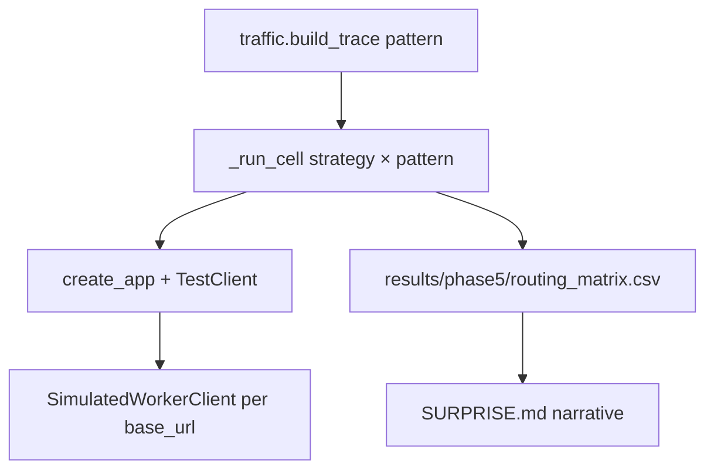

**Files:**

| File | Role |
| --- | --- |
| `benchmarks/traffic.py` | Frozen traces: `high_reuse`, `low_reuse`, `steady`, `bursty` |
| `benchmarks/fake_worker.py` | Soft saturation latency model |
| `benchmarks/run_routing_matrix.py` | 3 strategies × 4 patterns → CSV |
| `benchmarks/test_routing_matrix_harness.py` | Harness tests |

**Headline cell (simulated):** high_reuse × prefix_aware → high hit rate, worse TTFT vs round_robin because of sticky saturation.

---

## 11. Fundamentals: Phase 1–3 experiments

### 11.1 Phase 1 — naive HF concurrency

| File | Role |
| --- | --- |
| `fundamentals/experiments/naive_hf_load.py` | Concurrent HF generate sweep → CSV |
| `fundamentals/experiments/plot_failure_curve.py` | Latency/VRAM cliff chart |
| `configs/models/phase1.yaml` | Model / concurrency config |
| `docs/runbooks/LOCAL_PHASE1.md` | How to run on laptop |

### 11.2 Phase 2 — CPU toys

| File | Concept taught |
| --- | --- |
| `fundamentals/allocators/allocator_sim.py` | Contiguous vs paged allocation fragmentation |
| `fundamentals/schedulers/scheduler_sim.py` | Static vs continuous batching |
| `fundamentals/prefix_cache/prefix_cache_sim.py` | Token-id prefix hash hits |

Outputs under `results/phase2/`. **These numbers are not GPU metrics.**

### 11.3 Phase 3 — vLLM reconciliation

| File | Role |
| --- | --- |
| `fundamentals/experiments/vllm_load.py` | Concurrency sweep against pinned vLLM |
| `fundamentals/experiments/plot_naive_vs_vllm.py` | Overlay chart |
| `notebooks/colab/phase3actual.ipynb` | Executed Colab T4 path |
| `workers/vllm_pin.py` | Version pin |
| `docs/runbooks/COLAB_KAGGLE.md` | `+cu129` wheel notes |

---

## 12. Configs, deploy sketches, and ops

### Configs

| Path | Purpose |
| --- | --- |
| `configs/tenants/example.yaml` | Demo API keys + RPM |
| `configs/models/workers.yaml` | Dual worker URLs |
| `configs/models/phase1.yaml` / `phase3.yaml` | Experiment configs |
| `configs/routing/strategies.yaml` | Strategy name list (docs/config hint) |
| `configs/observability/prometheus.yml` | Scrape config |

### Deploy

| Path | Honesty |
| --- | --- |
| `deploy/keda/atlas-queue-depth.yaml` | **Planning sketch** querying `atlas_queue_depth` — not applied to a live cluster |
| `deploy/helm/`, `deploy/k8s/` | Empty scaffolds |
| `platform/autoscaling/test_keda_sketch.py` | Asserts sketch references the right metric name |

---

## 13. File-by-file reference

### 13.1 `platform/`

| File | What it does |
| --- | --- |
| `gateway/app.py` | FastAPI factory, all HTTP routes, routing state, streaming proxy |
| `gateway/test_gateway_chat.py` | Chat happy path / validation contracts |
| `gateway/test_gateway_rpm.py` | RPM 429 behavior |
| `gateway/test_gateway_metrics.py` | Prometheus observe path |
| `gateway/test_gateway_routing_state.py` | loads / prefix_owners writeback |
| `gateway/test_gateway_live_events.py` | snapshot + SSE + catchup_only |
| `gateway/test_gateway_review_fixes.py` | Hardening regressions (502/auth/400 etc.) |
| `router/strategies.py` | Three routers + prefix key helpers |
| `router/test_router_strategies.py` | Strategy unit tests |
| `tenant/tenants.py` | YAML tenants + authenticate |
| `tenant/rpm.py` | Process-local sliding-window limiter |
| `tenant/test_tenant_auth.py` / `test_tenant_rpm.py` | Auth + RPM tests |
| `registry/workers_registry.py` | YAML workers + resolve by model |
| `registry/test_worker_registry.py` | Registry tests |
| `observability/atlas_metrics.py` | Prometheus + event publish |
| `observability/request_events.py` | Bounded event ring |
| `observability/otel_hooks.py` | Span helpers |
| `observability/test_*.py` | Metrics / OTEL tests |
| `autoscaling/test_keda_sketch.py` | KEDA YAML sketch guard |

### 13.2 `workers/`

| File | What it does |
| --- | --- |
| `openai_worker_client.py` | httpx OpenAI chat + stream TTFT timing |
| `vllm_pin.py` | Pin assert for 0.26.0 |
| `test_openai_worker_client.py` | Client tests |
| `health/`, `vllm/` | Placeholders |

### 13.3 `benchmarks/`

| File | What it does |
| --- | --- |
| `run_routing_matrix.py` | Matrix driver → CSV |
| `traffic.py` | Trace builders |
| `fake_worker.py` | Simulated saturation worker |
| `test_routing_matrix_harness.py` | Tests |

### 13.4 `fundamentals/`

| File | What it does |
| --- | --- |
| `experiments/naive_hf_load.py` | Phase 1 load sweep |
| `experiments/plot_failure_curve.py` | Phase 1 chart |
| `experiments/vllm_load.py` | Phase 3 load sweep |
| `experiments/plot_naive_vs_vllm.py` | Phase 3 overlay |
| `allocators/allocator_sim.py` | Paged vs contiguous |
| `schedulers/scheduler_sim.py` | Continuous vs static batch |
| `prefix_cache/prefix_cache_sim.py` | Prefix hash sim |
| Matching `test_*.py` | Unit guards |

### 13.5 `dashboard/` + `results/` + `docs/` (high level)

| Path | What it does |
| --- | --- |
| `dashboard/index.html` | Live feed UI |
| `results/phase1..5/` | Evidence artifacts |
| `docs/phases/*` | Per-phase plans, ACs, demos |
| `docs/testing/phase-*.tdd.md` | TDD evidence logs |
| `docs/knowledge/*` | Durable concept notes |
| `docs/research/*` | Paper → Atlas relevance |
| `docs/decisions/*` | ADRs |
| `docs/pitch/*` | Pitch + resume |
| `docs/HANDOFF.md` | Session resume |

---

## 14. Data contracts and HTTP API

### 14.1 Chat request (gateway)

```json
{
  "model": "Qwen/Qwen2.5-0.5B-Instruct",
  "messages": [
    {"role": "system", "content": "You are helpful."},
    {"role": "user", "content": "Hello"}
  ],
  "stream": false
}
```

### 14.2 Response headers (Atlas-specific)

| Header | Meaning |
| --- | --- |
| `x-atlas-worker-id` | Chosen replica |
| `x-atlas-route-strategy` | Strategy name |
| `x-atlas-route-reason` | Decision string |
| `x-atlas-tenant-id` | Tenant id |
| `x-atlas-rpm-scope` | Always `process-local` |
| `x-atlas-cache-signal` | `hit` / `miss` / `n/a` |

### 14.3 Error envelope

```json
{"error": {"message": "...", "type": "authentication_error|rate_limit_error|..."}}
```

Status mapping: 400 validation, 401 auth, 403 model not allowed, 404 no workers, 429 RPM, 502 upstream httpx failure.

### 14.4 Event JSON (public)

```json
{
  "id": 12,
  "ts": 1710000000.0,
  "tenant_id": "demo",
  "strategy": "prefix_aware",
  "worker_id": "worker-a",
  "reason": "prefix hit hash=... ->worker-a",
  "cache_signal": "hit",
  "outcome": "ok",
  "ttft_ms": 12.5,
  "completion_ms": 40.0,
  "tokens_per_s": null,
  "queue_depth": 1.0
}
```

---

## 15. Honesty rules and known ceilings

Copied from the operational contract used by Phase 6 / HANDOFF:

1. Phase 2 sims ≠ Phase 1/3 GPU metrics.
2. No GIL/kernel root-cause claims without a profiler trace.
3. Toy / router prefix signal ≠ vLLM block-aligned APC.
4. Phase 3 latency = batch wall, not streaming TTFT.
5. Phase 3 VRAM = NVML; Phase 1 = torch peak — different meters.
6. Naive vs vLLM overlay is **cross-hardware** (3050 vs T4).
7. Phase 5 = `worker_mode=simulated`.
8. Never invent dashboard metrics; never store prompts in events.
9. RPM, queue depth, event ring are process-local.
10. RPM charges on accept.
11. KEDA YAML is a sketch.
12. No empty demo video link until a real recording exists.

**Known ceilings (upgrade paths called out in code/docs):**

| Ceiling | Upgrade when |
| --- | --- |
| Process-local RPM / events | Multi-replica shared store / bus |
| Prefix owner map no eviction | LRU if unique-prefix growth matters |
| Prefix hash not block-aligned | Real vLLM KV cache events |
| No TTFT load gate | After accepting Phase 5 loss case |
| Simulated matrix only | Optional Colab dual-vLLM re-run |

---

## 16. How to run everything

```powershell
cd C:\projects\Atlas
uv sync

# Unit/contract suite (platform + workers + benchmarks)
uv run pytest platform workers benchmarks -q

# Gateway + dashboard
uv run uvicorn app:create_app_from_env --factory --app-dir platform/gateway --port 8080
# http://127.0.0.1:8080/dashboard/  (key: sk-atlas-demo-key)

# Phase 5 offline matrix
uv run python benchmarks/run_routing_matrix.py

# Phase 2 toys
uv run python fundamentals/allocators/allocator_sim.py
uv run python fundamentals/schedulers/scheduler_sim.py
uv run python fundamentals/prefix_cache/prefix_cache_sim.py
```

Phase 1 GPU and Phase 3 Colab need hardware + runbooks:

- `docs/runbooks/LOCAL_PHASE1.md`
- `docs/runbooks/COLAB_KAGGLE.md`

---

## 17. What was deliberately not built

| Temptation | Status |
| --- | --- |
| Postgres orgs / billing | Not built (YAML tenants) |
| React SPA / Grafana-as-primary | Static HTML dashboard instead |
| DistServe on one GPU | Forbidden claim |
| Multi-node llm-d deploy | Research notes only |
| TTFT load gate | Documented follow-up |
| Phase 5.5 demo video | Deferred; runbook ready |
| Claiming KEDA live | Sketch only |

---

## Appendix A — End-to-end mental model

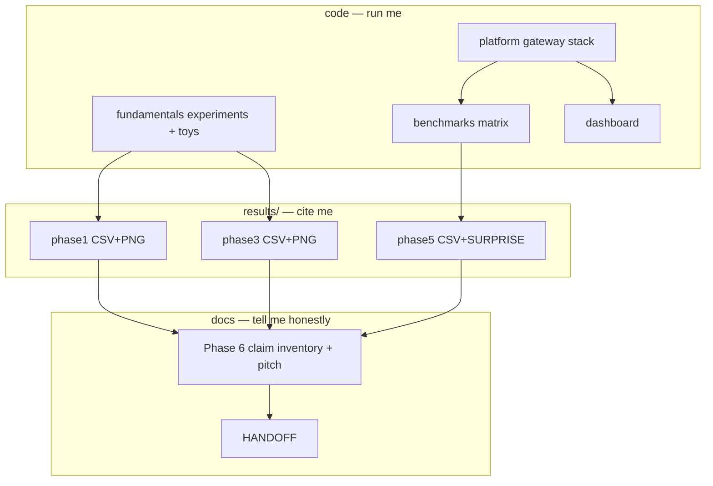

## Appendix B — Quick “where do I look?”

| Question | Look here |
| --- | --- |
| How does a chat request route? | §5 + `platform/gateway/app.py` |
| How does prefix-aware decide? | §6 + `platform/router/strategies.py` |
| Why did prefix-aware lose? | `results/phase5/SURPRISE.md` |
| What numbers can I say publicly? | `docs/phases/phase-6/CLAIM_INVENTORY.md` |
| How do I resume in a new chat? | `docs/HANDOFF.md` |
| What is the north star? | `docs/architecture/TARGET_ARCHITECTURE.md` |

---

*This document describes the free-path Atlas MVP as implemented through Phase 6. If code and this doc disagree, trust the code and update this file.*
