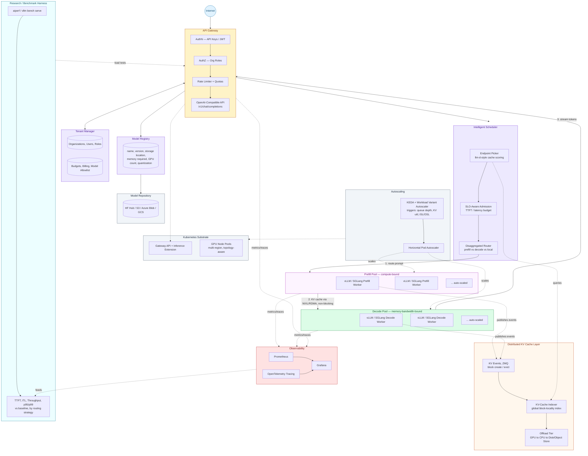

# Atlas — Target / Production Architecture

Vision this MVP steps toward. Informed by llm-d, NVIDIA Dynamo, and AIBrix: disaggregated prefill/decode, distributed KV-cache indexer, multi-region Kubernetes, SLO-aware autoscaling.

**Honest scope:** this diagram is the north star. On the free path it is **not** claimed as implemented — Phase 6 states disaggregation / RDMA as informed future work. See [MVP architecture](MVP_ARCHITECTURE.md) for what actually runs on one T4/3050.

Paste into [mermaid.live](https://mermaid.live), a GitHub `.md` fence, or Confluence Mermaid.

## Diagram

## Directory → subsystem (Atlas repo)

Maps the vision onto folders. MVP only implements the free-path subset — see [MVP architecture](MVP_ARCHITECTURE.md).

| Subsystem | Path | First appears |
| --- | --- | --- |
| Memory math / naive baseline | `fundamentals/memory`, `fundamentals/experiments` | Phase 1 |
| Toy allocator / scheduler / prefix | `fundamentals/allocators\|schedulers\|prefix_cache` | Phase 2 |
| OpenAI-compatible gateway | `platform/gateway` | Phase 4 |
| Tenant / keys / quotas | `platform/tenant` | Phase 4 |
| Model registry | `platform/registry` | Phase 4 |
| Prefix-aware / intelligent router | `platform/router` | Phase 4–5 |
| Autoscaling (KEDA later) | `platform/autoscaling` | Phase 4 |
| vLLM workers | `workers/vllm` | Phase 3–4 |
| Benchmarks | `benchmarks/` | Phase 1+ |
| Live dashboard | `dashboard/` | Phase 5.5 |
| Helm / K8s | `deploy/` | Phase 4+ (optional on free path) |

## Scaling rule

- **Do not** invent new top-level folders for features. Extend the table above.
- **Do** keep measured artifacts in `results/phaseN/` and narrative in `docs/`.
- Toy code stays in `fundamentals/`; production path stays in `platform/` + `workers/`. Never merge them into one package.

## Related

- [MVP architecture](MVP_ARCHITECTURE.md)  
- [MVP vs final capability table](MVP_VS_FINAL.md)  
- Research: [llm-d](../research/llm-d/), [DistServe](../research/distserve/), [disaggregated serving](../research/disaggregated-serving/)
