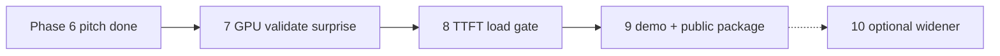

# Hire-signal arc — Phases 7–10

**Purpose:** Turn the completed free-path MVP (Phases 0–6) into a **30 LPA+ outshiner**: GPU-backed surprise, load-gate fix, 90s demo, public package.  
**Rule:** no DistServe/RDMA theater; every public number stays inventory-backed.  
**Order is strict:** 7 → 8 → 9. Phase 10 is optional and must not dilute 7–9.

| Phase | Goal | Eye-stopper | Depends on |
| --- | --- | --- | --- |
| [7](phase-7/) | Live dual-vLLM validation of high_reuse surprise | `results/phase5-live/` GPU CSV + write-up | Phase 5 sim closed |
| [8](phase-8/) | TTFT / load gate on prefix-aware | Before/after table: RR vs sticky vs gated | Phase 7 (prefer GPU; sim OK for RED) |
| [9](phase-9/) | Shock package: demo video + public narrative | 90s video link + README top sell | Phase 7 required; 8 strongly preferred |
| [10](phase-10/) | Optional widener (one only) | One extra artifact (RAG lane / eval / cost) | Phase 9 done |

## Success bar (resume-ready)

You can say, with file paths:

> On dual vLLM workers I measured high prefix reuse making sticky cache-aware routing worse on TTFT than round-robin despite high hit rate; I added a TTFT load gate that recovered latency while preserving hits; here is the 90s demo and CSV.

Until Phase 7 + 9 exist, do **not** market Atlas as the outshiner.

## Honesty carry-forward

- Phase 5 sim remains labeled `worker_mode=simulated`.
- Phase 7 may **confirm or refute** the sim — publish the truth either way.
- Process-local RPM/events stay labeled.
- Empty video URLs forbidden until a real recording exists.
- Update `docs/phases/phase-6/CLAIM_INVENTORY.md` when new measured claims ship.

## Suggested calendar (~3 weeks)

| Week | Phase | Output |
| --- | --- | --- |
| 1 | 7 | Live high_reuse cell + `SURPRISE_GPU.md` |
| 2 | 8 | Gate + before/after CSV (sim + live if possible) |
| 3 | 9 | Video + README top + blog/LinkedIn draft |

Start here: [`phase-7/START_HERE.md`](phase-7/START_HERE.md).
