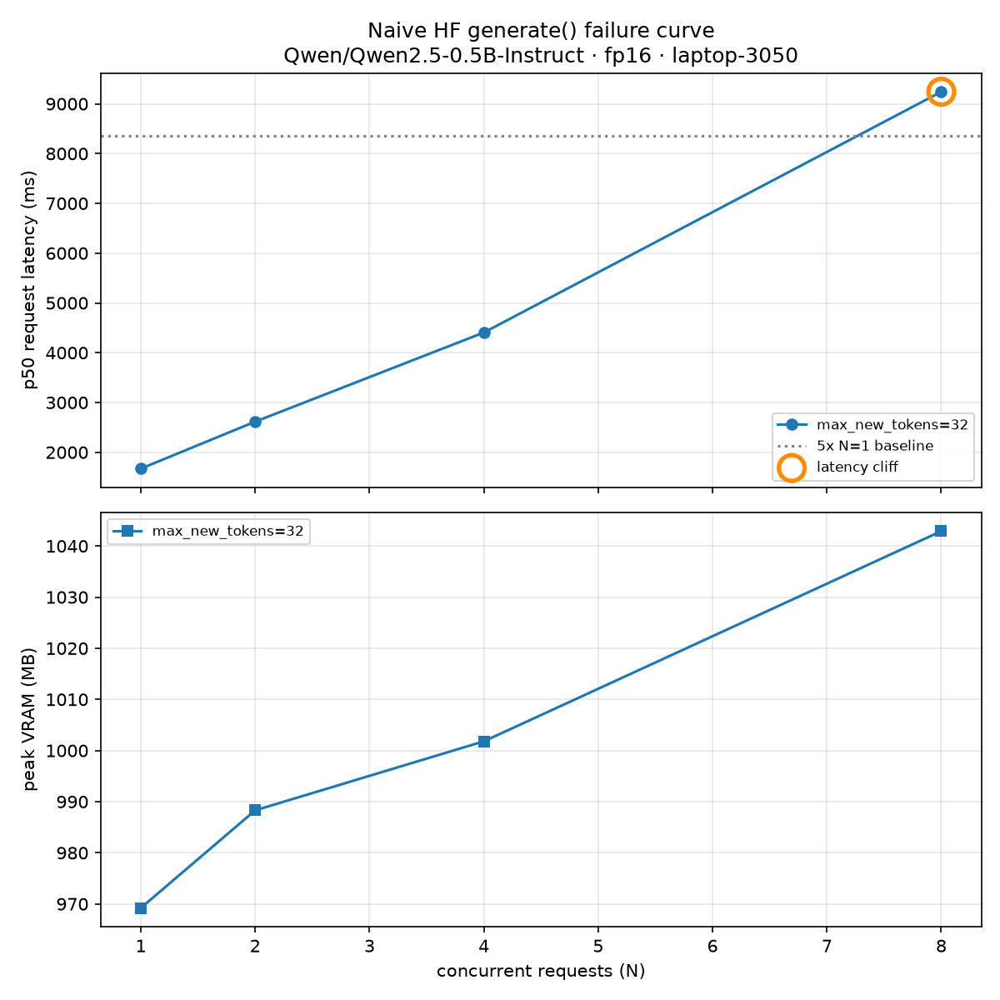

# Phase 1 — Failure curve (eye-stopper)

## Chart checklist

- [x] X-axis: concurrency (or seq length) — labeled
- [x] Y-axis: latency (ms) and/or tokens/s — labeled
- [x] OOM points marked distinctly (or second panel: peak VRAM)
- [x] Hardware + model in title
- [x] Data file path in caption: `results/phase1/naive_load.csv`
- [x] Image saved: `results/phase1/oom_latency_curve.png`

## Embed

## Caption

> Naive HuggingFace `generate()` on **laptop RTX 3050 (4 GiB)** with **Qwen2.5-0.5B-Instruct fp16**,
> 32 new tokens per request. p50 latency **collapses at N=8** — 9242 ms, or **5.5× the N=1 baseline**
> of 1671 ms — while peak VRAM never exceeds **1043 MB of 4096 MB**. This **contradicts** the Phase 1
> memory prediction that `B=8` would be the first memory-bound combo: KV never came close to VRAM.
> Data: `results/phase1/naive_load.csv`. Reproduce: `uv run python fundamentals/experiments/plot_failure_curve.py`.

## What the curve actually says

| N | p50 latency (ms) | vs N=1 | per-request tok/s | aggregate tok/s | peak VRAM (MB) |
| --- | --- | --- | --- | --- | --- |
| 1 | 1671 | 1.0× | 19.15 | 19.2 | 969.2 |
| 2 | 2614 | 1.6× | 12.24 | 24.5 | 988.3 |
| 4 | 4405 | 2.6× | 7.27 | 29.1 | 1001.8 |
| 8 | 9242 | **5.5×** | 3.46 | 27.7 | 1042.9 |

Three readings, in order of importance:

1. **Latency grows almost linearly with N (5.5× for 8× load).** Perfect batching would keep latency
   near flat; perfect serialization would give 8×. We measured 5.5×, so this threaded
   per-request `generate()` harness did not turn eight clients into proportionally more useful work.
   The run has no CPU/GPU trace, so it does **not** attribute that result to the GIL, kernels, or a
   particular allocator.
2. **Aggregate throughput is flat.** 8× the offered load bought **1.45×** the tokens/s (19.2 → 27.7),
   and it already peaked at N=4. Extra concurrency past that buys latency, not work.
3. **This sweep did not reach a VRAM limit.** VRAM moved 969 → 1043 MB across the whole sweep, using
   **25% of the card**. It demonstrates a scheduling/throughput problem before capacity becomes the
   limiting condition; it does not rule out a capacity failure at longer sequence lengths.

## Where the Phase 1 math was right and wrong

**Right — the weights term.** Predicted `0.494e9 × 2 B ≈ 942 MiB`; measured N=1 peak was
**969.2 MiB**, a 3% gap that the activation/allocator headroom explains. The formula holds.

**Wrong — the failure mode.** [`01_memory_math.md`](01_memory_math.md) predicted first failure at
`B=8, S=4096` from KV growth. At the sweep's actual `S ≈ 55` tokens (23 prompt + 32 generated), KV
for 8 concurrent requests is only **5.2 MiB** — the prediction was never going to be exercised at
this sequence length. The honest correction: *my sweep varied concurrency but not sequence length,
so it tested the scheduler, not the KV budget.*

**A finding the math did not predict at all.** Going from N=1 to N=8 should have added
`7 × 55 × 12288 B ≈ 4.5 MiB` of KV. Measured growth was **73.7 MiB — about 16× the KV math**.
This peak-memory metric includes all framework allocations, so it cannot isolate KV allocation,
padding, activations, or fragmentation. It is a measured reason to test paging in Phase 2, not
proof that any one of those components caused the difference.

## Known gap

This sweep holds `S` roughly constant and varies `N`. A sequence-length sweep (the `S=2048/4096`
rows in the memory table) would be needed to drive an actual CUDA OOM and validate the KV term
directly. Deferred — the scheduler failure is the one Phase 2 has to fix first, and it is now
measured.
