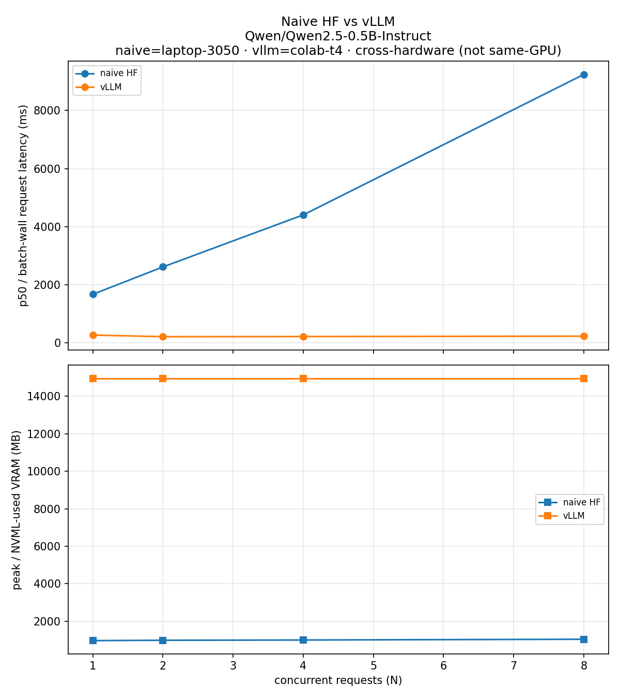

# Phase 3 — Before/after chart

**Status: measured (AC-005).** Colab T4 run via `notebooks/colab/phase3actual.ipynb`.

## Caption

| Item | Value |
| --- | --- |
| vLLM | **0.26.0** (`notes` / pin); Colab T4 (CUDA 12.x → `+cu129` wheel path) |
| Model | `Qwen/Qwen2.5-0.5B-Instruct` @ `7ae5576…`, float16 |
| Naive baseline | `results/phase1/naive_load.csv` — **laptop-3050** |
| vLLM sweep | `results/phase3/vllm_load.csv` — **colab-t4** |
| Concurrency | N = 1, 2, 4, 8 · `max_new_tokens=32` · all `status=ok` (no cliff stop on vLLM) |
| Latency meter | vLLM: **batch wall** (`ttft_proxy=batch_wall`); naive: per-thread wall (`ttft_proxy=total`) |
| VRAM meter | vLLM: **NVML used** ≈ 14956 MB flat (preallocated pool); naive: torch peak ≈ 969–1043 MB |
| Protocol | One `LLM.generate([p0..pN-1])` with `[req=i]` · `batch_generate=1` |

### Measured latency (ms)

| N | Naive (3050) | vLLM (T4) | Naive / vLLM |
| --- | --- | --- | --- |
| 1 | 1671 | 266 | ~6.3× |
| 2 | 2614 | 210 | ~12× |
| 4 | 4405 | 216 | ~20× |
| 8 | 9242 | 229 | ~40× |

Naive hits a **5.5× cliff** at N=8 vs its N=1. vLLM stays ~210–266 ms across N (no cliff in this sweep).

### What this does / does not prove

- **Does:** Same load-shape philosophy on real vLLM; continuous-batching path scales where naive HF cliffs; chart is explicitly **cross-hardware**.
- **Does not:** Same-GPU A/B; streaming TTFT; identical VRAM meters (NVML pool vs torch peak). T4 has far more VRAM than the 3050 — the ~15 GB flat NVML line is vLLM’s cache preallocation on T4, not “15× worse memory efficiency” as a fair single-GPU claim.

Source-level toy vs engine: `02_source_diff.md`.
