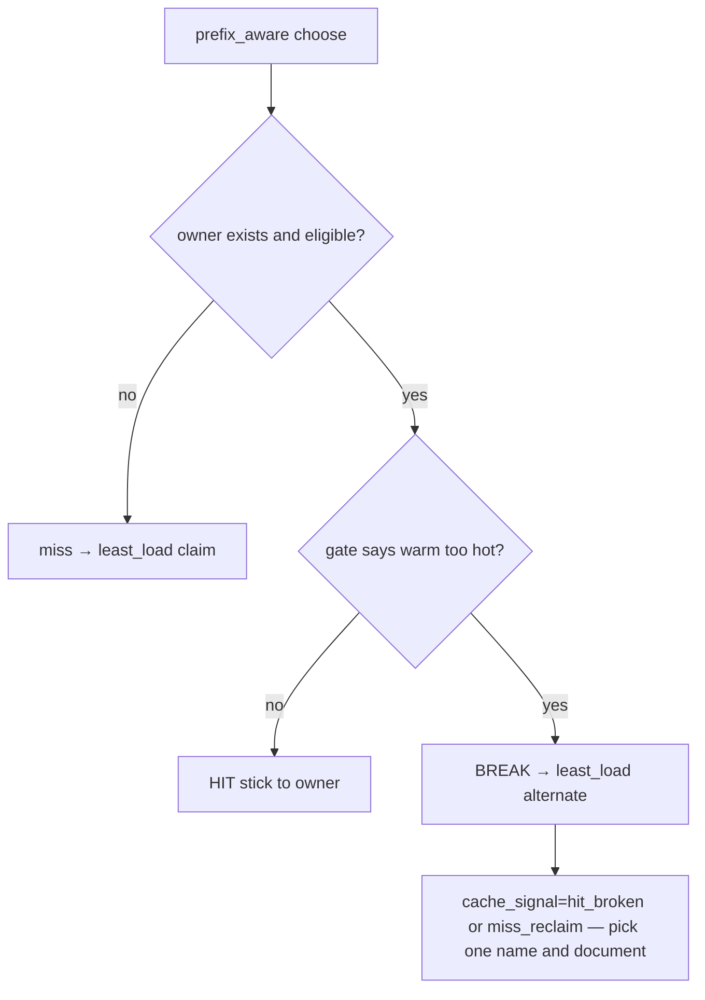

# Phase 8 — TTFT / load gate on prefix-aware

**Status:** Not started  
**Depends on:** Phase 7 artifacts preferred; RED/GREEN TDD may use sim first  
**Eye-stopper:** Before/after table — RR vs sticky prefix_aware vs **prefix_aware+gate**  
**ACs:** [ACCEPTANCE.md](ACCEPTANCE.md)

## Goal

Close the loop on the Phase 5/7 failure mode: sticky affinity saturates one replica. Add a **load / TTFT gate** that breaks stickiness when the warm worker is too hot vs a cooler eligible replica — the industry-shaped fix (cf. llm-d-style max TTFT penalty), implemented minimally on Atlas’s free path.

## Design (keep small)

### Recommended minimal gate

**Input:** `loads` (in-flight) and/or soft saturation signal already used in sim (`served_count` only in fake worker — live may use queue_depth / in-flight only).

**Rule (v1):** If owner load ≥ `alternate_load + load_margin` (config int, default 1), route to least-load eligible worker instead of sticky owner.

**Optional v1.1:** Also break if owner in-flight ≥ hard cap.

**Out of scope for v1:** Predicting true engine TTFT from KV events; precise APC scorer.

Document reason strings, e.g. `prefix hit broken by load_gate load=3 vs alt=0 ->worker-b`.

## Config

Prefer env or small YAML knob — do not over-abstract:

- `ATLAS_PREFIX_LOAD_MARGIN` (default `1`)
- or field in `configs/routing/strategies.yaml`

## Artifacts

| Path | Contents |
| --- | --- |
| Code | Gate inside `PrefixAwareRouter` or thin wrapper; gateway passes loads |
| Tests | Unit: sticky when cool; break when hot; miss path unchanged |
| `results/phase8/gate_matrix.csv` | RR / prefix / prefix+gate × high_reuse (sim required; live if Phase 7 workers available) |
| `results/phase8/BEFORE_AFTER.md` | Hit%, TTFT p50/p95, skew — three-way compare |

## Honesty

- Gate is **heuristic**, not llm-d production EPP.
- Live before/after only if Phase 7 replica setup still reproducible.
- Do not claim “X% improvement” without CSV rows.

## Out of scope

- Demo video (Phase 9)
- Redis distributed load map
- DistServe
